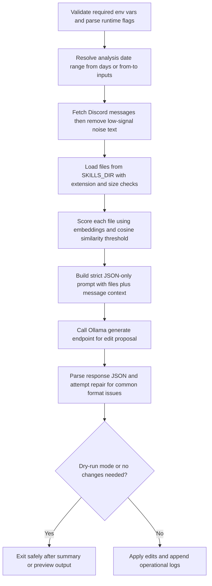
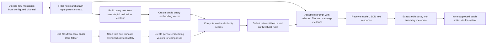
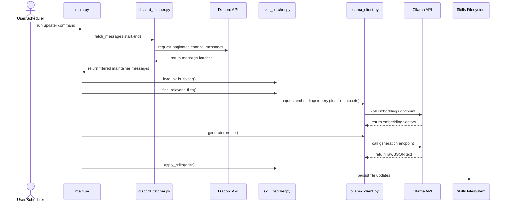
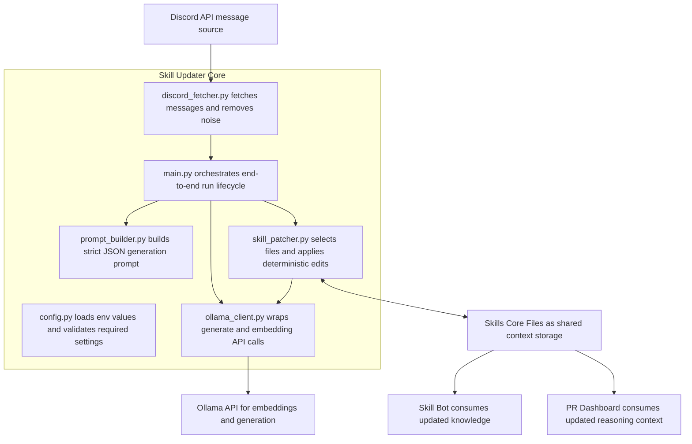
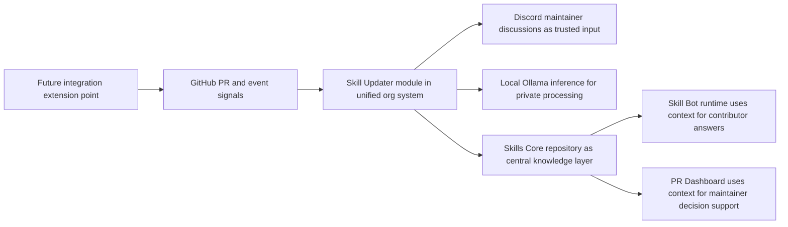

# Skill Updater MVP overview 

summary of the current Skill Updater MVP implementation in this repository.

It is written as a system module view (not a standalone app):

- Skill Updater writes structured knowledge into Skills Core.
- Skill Bot and PR Dashboard consume Skills Core.
- This MVP focuses on the Skill Updater interaction boundary and internal pipeline.

Reading guide:

- Each shape text is written as an action plus expected output.
- Boxes show processing steps.
- Diamond shapes show mandatory checks or branch decisions.
- Right-most boxes usually represent user-facing or system-level impact.

---

## 1) End-to-End MVP (System Fit)

```mermaid
flowchart LR
  A[Run updater from CLI or scheduler job] --> B[Fetch only maintainer Discord messages with time window]
  B --> C[Load current Skills Core files from SKILLS_DIR of that repo]
  C --> D[Run embedding relevance filter to keep only useful files]
  D --> E[Build strict JSON prompt from messages plus selected files]
  E --> F[Generate structured JSON edits using local Ollama model]
  F --> G[Apply safe patch operations to skill files]
  G --> H[Persist updated Skills Core knowledge on filesystem]
  H --> I[Enable better Skill Bot answers and PR Dashboard reasoning]
```

Description:

- This is the top-level loop your organization needs to understand.
- The updater does not answer users directly; it improves shared context quality.
- Value path is: maintainer knowledge from Discord -> structured skill updates -> better downstream AI behavior.
- Treat this as a knowledge maintenance pipeline, not a chatbot runtime.

---

## 2) Internal Pipeline (Code-Level Flow)

Description:

- This matches the actual orchestration in `main.py`.
- The only probabilistic stage is LLM generation; all downstream steps are guarded.
- Most production risk is controlled after generation by strict parse and patch guards.
- Even when model output is imperfect, the pipeline prefers safe failure over unsafe writes.

---

## 3) Data Flow (What Moves Through the System)

Description:

- Inputs are two streams: maintainer messages and current skill files.
- Relevance filtering reduces prompt size and keeps updates targeted.
- Output is structured edits, not free-text suggestions.
- The important design choice is structure over prose: JSON edits are easier to validate than natural-language suggestions.

---

## 4) Runtime Sequence (Interaction by Module)

Description:

- This clarifies ownership: `main.py` orchestrates, helpers are single-purpose.
- Discord and Ollama are external dependencies.
- Skill storage remains plain files, preserving git-native review and rollback.
- Sequence view is best for understanding call order and boundaries.
- Component view (Section 6) is best for understanding long-term maintainability.

---

## 5) Component Architecture (Current MVP Boundaries)

Description:

- `config.py` centralizes environment + validation constants.
- `discord_fetcher.py` owns Discord pagination, author filtering, and noise removal.
- `skill_patcher.py` owns both relevance selection and deterministic patch operations.
- Skills Core remains the shared contract with the rest of your org architecture.
- If you need one maintenance entry point, start from `main.py` then inspect each module in call order.

---

## 6) Integration View (Org-Level Interaction)

Description:

- This positions the MVP in the broader organization ecosystem.
- Current integration is stable and file-based.
- Future webhook/event integration can be added without replacing the core updater pipeline.

---

## 7) Key info

1. Maintainer-only message filtering is enforced by Discord author ID matching.
2. Reply-parent context is fetched and attached to improve interpretation.
3. Noise filtering removes low-signal chat text before model invocation.
4. File scanning uses extension allowlist plus max-size truncation guard.
5. Relevance stage uses embeddings + cosine threshold and always includes primary skill file.
6. Prompt builder requests strict JSON-only edits with explicit schema-like structure.
7. JSON parser includes repair attempts for common malformed model output.
8. Edit engine supports `create`, `append_section`, `append_end`, `replace` with guardrails.
9. Dry-run path exists for preview without file mutation.(even include in attach tutorial)