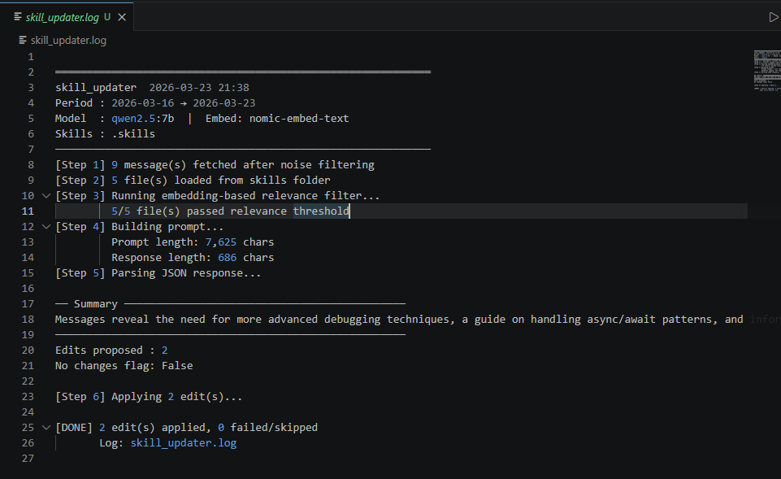
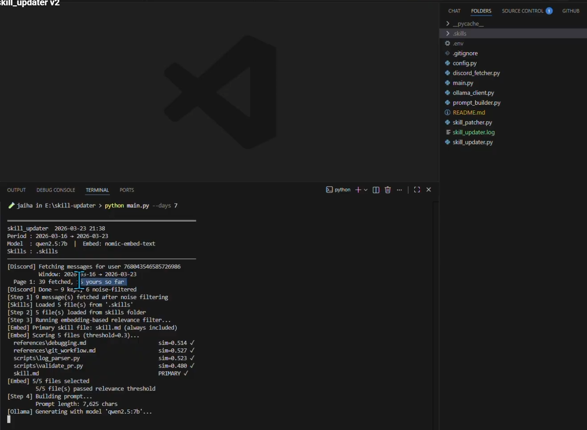
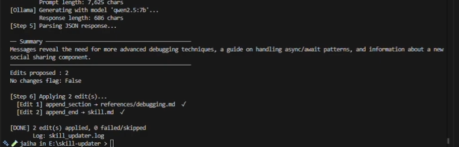
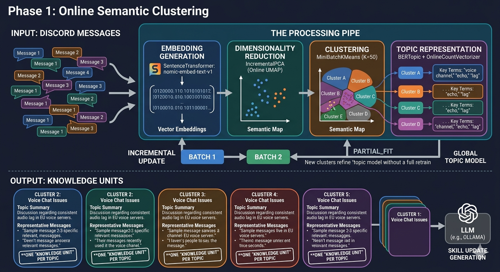
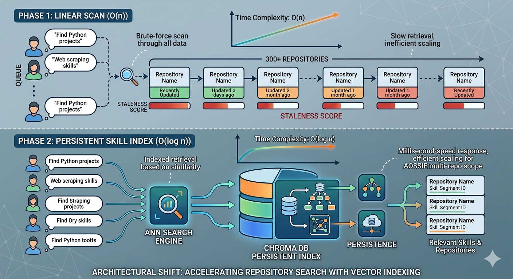
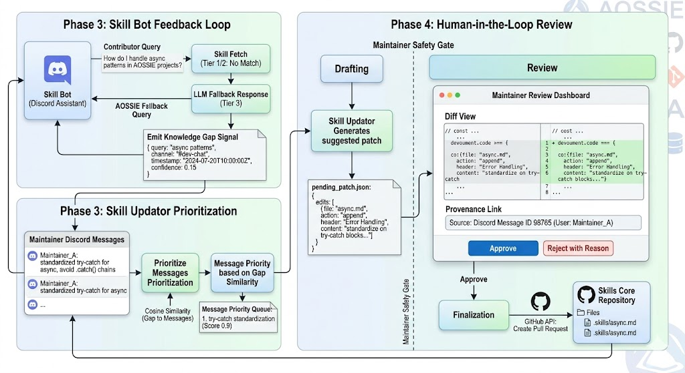

# Skill Updater — ROADMAP

> **Module:** Skill Updater (Knowledge Evolution Layer)
> **Role in System:** Writes to Skills Core → improves Skill Bot responses → improves PR Dashboard reasoning
> **Design Constraint:** Maintainer-only source, Git-backed, local-first (Ollama + nomic-embed-text)

---

## Current State (v2 — Deterministic Foundation)

The existing pipeline is intentionally simple and safe:

```
Discord REST API → role filter → cosine similarity (nomic-embed-text)
→ Prompt Builder → Ollama LLM → JSON patch → skill_patcher.py → Skills Core (Git)
```

**What works well:**
- Verbatim match guard prevents hallucinated replacements
- Append deduplication (header-exists check)
- Git-backed output = auditable change history
- Zero cloud cost (fully local)

**POC Demonstrations:**


*Detailed execution log showing the complete pipeline: Discord fetch → embedding filter → skill file matching → LLM generation → JSON patch application*


*End-to-end system integration: VS Code editor with project structure on left, showing all Python modules (discord_fetcher, ollama_client, prompt_builder, skill_patcher) running in terminal with real-time execution flow*


*Zoomed execution summary demonstrating the successful completion of all 6 pipeline steps with final patch application results (2 edits applied, 0 failures)*

**Known limitations that the roadmap addresses:**
- Flat file scan (O(n) per message, not semantic index)
- No topic grouping — each message treated independently
- No staleness detection (outdated skill content not flagged)
- No feedback loop from Skill Bot's low-confidence answers
- Manual CLI trigger only — no scheduled automation

**video tutorial**: https://www.youtube.com/watch?v=xMHPiydEukE

---

## Phase 0 — Stability Hardening (Current Sprint)

Goal: Make v2 production-safe before adding complexity.

**Tasks:**
- [ ] Fuzzy fallback for failed `replace` operations (log "Manual Review Required")
- [ ] Embedding cache — same text = same vector, avoid re-embedding known messages
- [ ] connect to skill core and it's metadata to get more context about the skill files (e.g. which feature they belong to, when they were last updated, etc.) and use that context in the prompts to improve relevance and reduce noise.

```python
# Embedding cache pattern (avoid re-embedding known messages)
cache = {}  # {message_id: embedding_vector}

def get_embedding(msg_id, text):
    if msg_id not in cache:
        cache[msg_id] = ollama_embed(text)
    return cache[msg_id]
```

---

## Phase 1 — Online Semantic Clustering 

Goal: Group related Discord discussions before generating skill updates — one "Knowledge Unit" per topic cluster, not one update per message.

**Approach: BERTopic Online Mode**

```python
from bertopic import BERTopic
from sklearn.decomposition import IncrementalPCA
from sklearn.cluster import MiniBatchKMeans
from bertopic.vectorizers import OnlineCountVectorizer

# Online-capable sub-models
umap_model = IncrementalPCA(n_components=5)
cluster_model = MiniBatchKMeans(n_clusters=50, random_state=42)
vectorizer_model = OnlineCountVectorizer(stop_words="english", decay=0.01)

topic_model = BERTopic(
    umap_model=umap_model,
    hdbscan_model=cluster_model,     # replaced HDBSCAN with MiniBatchKMeans
    vectorizer_model=vectorizer_model,
)

# Train on first batch
topics, _ = topic_model.fit_transform(batch_1)

# Incremental update — no full retraining
topics, _ = topic_model.partial_fit(batch_2)
```

**Embedding integration with existing stack:**

```python
from sentence_transformers import SentenceTransformer
# nomic-embed-text via sentence-transformers (local, matches current stack)
embedding_model = SentenceTransformer("nomic-ai/nomic-embed-text-v1", trust_remote_code=True)
topic_model = BERTopic(embedding_model=embedding_model)
```

**Output:** Cluster ID + representative messages → one LLM call per cluster, not per message. Reduces noise, reduces Ollama calls.

**Real-world reference:** [RepoAgent](https://github.com/OpenBMB/RepoAgent) uses a similar batch-then-update pattern for Git-tracked documentation. [BERTopic merge_models](https://github.com/MaartenGr/BERTopic) enables daily mini-models merged weekly.

* see tutorial on BERTopic: https://www.youtube.com/watch?v=v3SePt3fr9g

**below image is generated by AI for better visualization.**


---

## Phase 2 — ChromaDB Persistent Skill Index 

Goal: Replace flat file scan with a persistent vector index so the semantic router is O(log n) not O(n).

**Current flow:**
```
New message → embed → cosine compare ALL skill files → pick top-k
```

**New flow:**
```
New message → embed → ChromaDB ANN search → top-k skill files in ~5ms
```

**Implementation:**

```python
import chromadb

client = chromadb.PersistentClient(path="./chroma_skills")
collection = client.get_or_create_collection("skill_files")

# Index skill files at startup / on git pull
for skill_file in glob("skills/**/*.md"):
    content = read(skill_file)
    embedding = nomic_embed(content)
    collection.upsert(
        ids=[skill_file],
        embeddings=[embedding],
        documents=[content],
        metadatas=[{"path": skill_file, "repo": extract_repo(skill_file)}]
    )

# Query
results = collection.query(query_embeddings=[msg_embedding], n_results=3)
```

**Also adds:**
- Staleness score: embed current skill file + compare to recent cluster centroid. If cosine distance > threshold → flag as "potentially outdated" → create maintainer PR review request
- Handles multi-repo AOSSIE scale (300+ repos) without linear slowdown

* See similar tweet-scale semantic search using ChromaDB:https://www.youtube.com/watch?v=NPgntX4Qa2w

**below image is generated by AI for better visualization.**



---

## Phase 3 — Skill Bot Feedback Loop 

Goal: Let Skill Bot's "low confidence" answers drive the Updater's prioritization.

**Signal:** When Skill Bot falls back to LLM (tier 3, no skill match), log:

```python
# In skill_bot.py — emit knowledge gap signal
if response_source == "llm_fallback":
    gap_log.append({
        "question": user_query,
        "channel": ctx.channel.name,
        "timestamp": datetime.utcnow().isoformat(),
        "confidence": similarity_score
    })
```

**Skill Updater consumes this:**

```python
# Priority queue: gaps from Skill Bot weighted higher
gap_topics = load_gap_log()  # questions bot couldn't answer from skills
discord_messages = fetch_maintainer_messages()

# Score Discord messages: does this message address a known gap?
for msg in discord_messages:
    gap_score = max(cosine_sim(embed(msg), embed(gap)) for gap in gap_topics)
    msg["priority"] = gap_score
```

**This closes the system loop:**
```
Skills Core ← written by Skill Updater
                  ↑ prioritized by
Skill Bot → emits gap signals → Skill Updater
```
* watch this tutorial on building a feedback loop (little bit longer):https://www.youtube.com/watch?v=6VcXukJuGA0
---

## Phase 4 — Human-in-the-Loop Review Dashboard 

Goal: Maintainer approval gate before any skill file is modified in the repo.

**Why:** LLMs hallucinate. Even with verbatim guards, append operations can add wrong context. Maintainers must remain in control.

**Architecture:**

```
Skill Updater generates patches → writes to pending_patches.json
↓
Lightweight web dashboard (FastAPI + HTMX or simple HTML)
↓
Maintainer sees: [diff view] + [source Discord message] + [Approve / Reject / Edit]
↓
Approved patches → Git commit + PR via GitHub API
Rejected patches → logged with rejection reason (feeds future prompt improvement)
```

**Key design decisions (grounded in RepoAgent pattern):**
- Dashboard is **read/write only for patches** — no direct skill file editing
- Each patch traces back to exact Discord message(s) that generated it (full provenance)
- Rejection reasons stored → used to improve LLM prompts in next iteration

**below image is generated by AI for better visualization.**



---

## Phase 5 — Cross-Repo Intelligence

Goal: Detect when a PR (via PR Dashboard) makes a skill file's content outdated.

**Trigger:**
1. PR Dashboard detects merged PR that changes a feature
2. PR's CodeRabbit summary embeds > threshold similarity to a skill file's content
3. Skill Updater receives flag: `{"skill_file": "skills/core/rate-limiting.md", "reason": "PR #412 changed rate limit logic"}`
4. Skill Updater searches Discord for recent maintainer discussion on the topic
5. Surfaces update suggestion (routed through Phase 4 review dashboard)

**This completes the full system loop:**
```
Code changes (PR Dashboard) → flags stale skills
Discord discussions (Skill Updater) → updates skills  
Skills Core → powers Skill Bot → gaps feed back to Skill Updater
```

---

## Technology Stack Summary

| Component | Current | Roadmap Addition |
|-----------|---------|-----------------|
| Embeddings | nomic-embed-text (Ollama) | sentence-transformers wrapper for BERTopic compatibility |
| Clustering | cosine similarity (flat) | BERTopic online mode (IncrementalPCA + MiniBatchKMeans) |
| Skill index | file scan | ChromaDB persistent collection |
| LLM | qwen2.5:7b / llama3.1:8b (Ollama) | same — no cloud dependency |
| Validation | JSON regex repair | JSON Schema + Pydantic |
| Review | none | FastAPI + HTMX review dashboard |
| Scheduling | CLI trigger | GitHub Actions cron / n8n workflow |


* See tutorial of RAG from scratch using LangChain, similar to this system’s retrieval and generation pipeline: https://www.youtube.com/watch?v=sVcwVQRHIc8
---

## Key Design Principles (Non-Negotiable)

1. **Maintainer-only source** — contributor messages never enter skill update pipeline
2. **Local-first** — no OpenAI/Anthropic API calls, no data leaves the machine
3. **Git-backed output** — every skill change is a reviewable commit
4. **Provenance** — every patch traces to its source Discord messages
5. **Incremental, not batch** — new messages extend the model, never trigger full retraining

---

## References

- [BERTopic Online Learning](https://maartengr.github.io/BERTopic/getting_started/online/online.html) — incremental topic modeling
- [BERTopic merge_models](https://www.maartengrootendorst.com/blog/bertopic/) — daily model merging pattern
- [RepoAgent](https://github.com/OpenBMB/RepoAgent) — LLM-powered doc update with Git change detection
- [HDBSCAN incremental limitation](https://arxiv.org/html/2601.20680) — why raw HDBSCAN fails in production streaming pipelines
- [ChromaDB persistent client](https://docs.trychroma.com/reference/py-client) — self-hosted vector index
